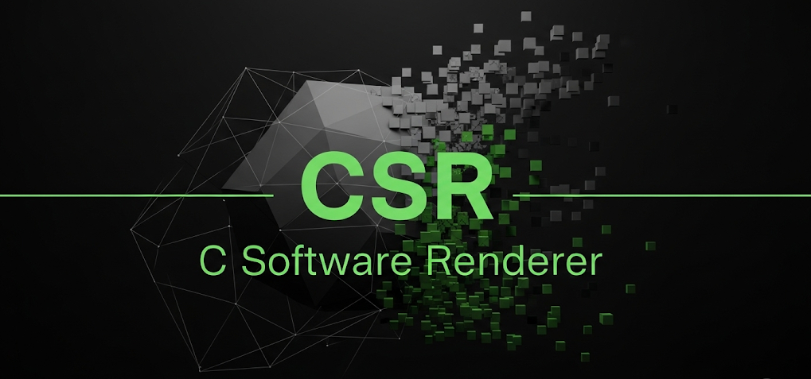
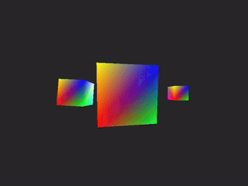

# csr
A C89 standard compliant, single header, nostdlib (no C Standard Library) software renderer (CSR).

<p align="center">
<a href="https://github.com/nickscha/csr"></a>
</p>

For more information please look at the "csr.h" file or take a look at the "examples" or "tests" folder.

> [!WARNING]
> THIS PROJECT IS A WORK IN PROGRESS! ANYTHING CAN CHANGE AT ANY MOMENT WITHOUT ANY NOTICE! USE THIS PROJECT AT YOUR OWN RISK!

<p align="center">
<a href="https://github.com/nickscha/csr"></a>
</p>

## Quick Start

Download or clone csr.h and include it in your project.

```C
#include "csr.h" /* C Software Renderer                                  */
#include "vm.h"  /* Linear Algebra Math library. Any library can be used */

int main() {

    /* Vertex data array with interleaved position and color (RGB) */
    float vertices[] = {
        /* Position x,y,z  | Color r,g,b */
        -0.5f, -0.5f,  0.5f, 255.0f,   0.0f,   0.0f, /* 0: Red     */
         0.5f, -0.5f,  0.5f,   0.0f, 255.0f,   0.0f, /* 1: Green   */
         0.5f,  0.5f,  0.5f,   0.0f,   0.0f, 255.0f, /* 2: Blue    */
        -0.5f,  0.5f,  0.5f, 255.0f, 255.0f,   0.0f, /* 3: Yellow  */
        -0.5f, -0.5f, -0.5f, 255.0f,   0.0f, 255.0f, /* 4: Magenta */
         0.5f, -0.5f, -0.5f,   0.0f, 255.0f, 255.0f, /* 5: Cyan    */
         0.5f,  0.5f, -0.5f, 255.0f, 255.0f, 255.0f, /* 6: White   */
        -0.5f,  0.5f, -0.5f, 128.0f, 128.0f, 128.0f  /* 7: Gray    */
    };

    /* Index data counterclockwise to form the triangles of a cube.  */
    int indices[] = {
        0, 3, 2, 0, 2, 1, /* Front face (+z normal, facing camera)   */
        4, 5, 6, 4, 6, 7, /* Back face (-z normal, away from camera) */
        3, 7, 6, 3, 6, 2, /* Top face (+y normal)                    */
        0, 1, 5, 0, 5, 4, /* Bottom face (-y normal)                 */
        1, 2, 6, 1, 6, 5, /* Right face (+x normal)                  */
        0, 4, 7, 0, 7, 3  /* Left face (-x normal)                   */
    };

    unsigned long vertices_size = sizeof(vertices) / sizeof(vertices[0]);
    unsigned long indices_size  = sizeof(indices)  / sizeof(indices[0]);

    /* Define the render area */
    #define WIDTH 400
    #define HEIGHT 300

    /* In this example we can fit everything on the stack! 

       For larger render areas you can allocate a block of memory like this:

       unsigned long memory_size = csr_memory_size(width, height);
       void *memory = your_memory_allocation_function(memory_size);
    */
    #define MEMORY_SIZE (WIDTH * HEIGHT * sizeof(csr_color)) + (WIDTH * HEIGHT * sizeof(float))
    unsigned char memory_total[MEMORY_SIZE] = {0};
    void *memory = (void *)memory_total;

    csr_color clear_color = {40, 40, 40};
    csr_context instance = {0};

    if (!csr_init_model(&instance, memory, MEMORY_SIZE, WIDTH, HEIGHT, clear_color))
    {
        return 1;
    }

    {
        /* CSR does not force you to a specific linear algebra vector math library!
           For demonstration use we use the "vm.h" library you can also find in the tests folder.
        */
        v3 world_up          = vm_v3(0.0f, 1.0f, 0.0f);
        v3 cam_position      = vm_v3(0.0f, 0.0f, 2.0f);
        v3 cam_look_at_pos   = vm_v3_zero;
        float cam_fov        = 90.0f;

        m4x4 projection      = vm_m4x4_perspective(vm_radf(cam_fov), (float)instance.width / (float)instance.height, 0.1f, 1000.0f);
        m4x4 view            = vm_m4x4_lookAt(cam_position, cam_look_at_pos, world_up);
        m4x4 projection_view = vm_m4x4_mul(projection, view);

        m4x4 model_base      = vm_m4x4_translate(vm_m4x4_identity, vm_v3_zero);
        v3 model_rotation    = vm_v3(0.5f, 1.0f, 0.0);

        int frame;

        for (frame = 0; frame < 10; ++frame)
        {   
            /* Rotate the cube around the model_rotation axis */
            m4x4 model_view_projection = vm_m4x4_mul(
                projection_view, 
                vm_m4x4_rotate(model_base, vm_radf(5.0f * (float)(frame + 1)), model_rotation)
            );

            /* Clear Screen Frame and Depth Buffer */
            csr_clear_screen(&instance);                                                                   

            /* Render cube */ 
            csr_render(&instance, 6, vertices, vertices_size, indices, indices_size, model_view_projection.e);

            /* Afterwards you can write the instance.framebuffer to a screen or write to a file (like ppm format).
            
               In the csr_test.c file we write each frame into a ppm file
               and then using ffmpeg (via the build.bat script) to generate a mp4 and gif file.
            */
        }
    }

    return 0;
}
```

## Run Example: nostdlib, freestsanding

In this repo you will find the "examples/csr_win32_nostdlib.c" with the corresponding "build.bat" file which
creates an executable only linked to "kernel32" and is not using the C standard library and executes the program afterwards.

## "nostdlib" Motivation & Purpose

nostdlib is a lightweight, minimalistic approach to C development that removes dependencies on the standard library. The motivation behind this project is to provide developers with greater control over their code by eliminating unnecessary overhead, reducing binary size, and enabling deployment in resource-constrained environments.

Many modern development environments rely heavily on the standard library, which, while convenient, introduces unnecessary bloat, security risks, and unpredictable dependencies. nostdlib aims to give developers fine-grained control over memory management, execution flow, and system calls by working directly with the underlying platform.

### Benefits

#### Minimal overhead
By removing the standard library, nostdlib significantly reduces runtime overhead, allowing for faster execution and smaller binary sizes.

#### Increased security
Standard libraries often include unnecessary functions that increase the attack surface of an application. nostdlib mitigates security risks by removing unused and potentially vulnerable components.

#### Reduced binary size
Without linking to the standard library, binaries are smaller, making them ideal for embedded systems, bootloaders, and operating systems where storage is limited.

#### Enhanced performance
Direct control over system calls and memory management leads to performance gains by eliminating abstraction layers imposed by standard libraries.

#### Better portability
By relying only on fundamental system interfaces, nostdlib allows for easier porting across different platforms without worrying about standard library availability.
